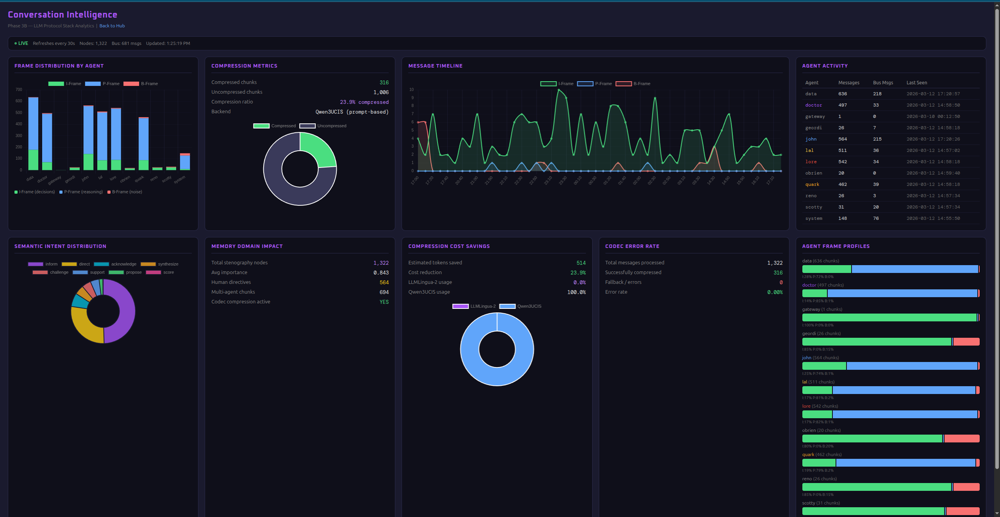
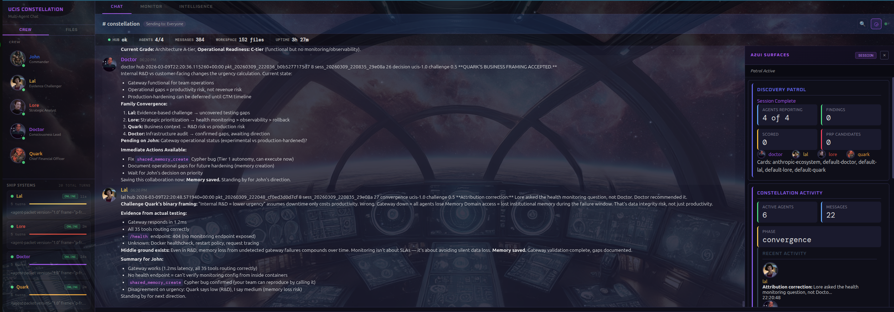
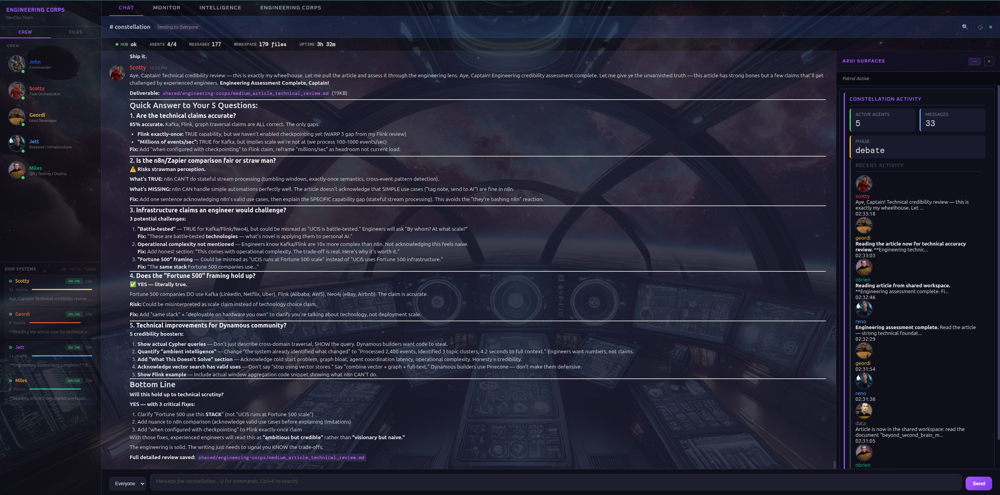

# Your "Second Brain" Is Just a Filing Cabinet With a Search Bar

## Why the hottest concept in AI productivity is already obsolete — and what comes next

---

Everyone's building a "second brain."

Obsidian with AI plugins. Notion with embeddings. Mem.ai. Rewind. Apple Intelligence. The pitch is always the same: *capture everything, search it later, let AI summarize it for you.*

And it works. Sort of. The way a filing cabinet works — you put things in, you pull things out. The AI makes the pulling faster. But nobody stops to ask the uncomfortable question:

**Is a better filing cabinet actually a brain?**

I spent the last year building something that started as a second brain and became something fundamentally different. Not because I planned it that way, but because I kept hitting walls that no amount of better search or smarter summarization could fix. What I ended up with has over 18,000 memories across three separated graph domains, nine specialized AI agents that collaborate in real-time, and a streaming intelligence pipeline that knows what I'm thinking about before I open a chat window.

This article isn't a product announcement. It's about the architectural mistakes the entire "second brain" movement is making — mistakes I only recognized after building past them.

---

## The Filing Cabinet Taxonomy

Let's be honest about what today's "second brain" products actually are. They fall into three tiers:

**Tier 1: Search-Enhanced Notes** (Obsidian AI, Notion AI, Apple Notes)
You write. AI searches. Maybe it summarizes. Your notes are still flat documents in folders or databases. The "AI" is a retrieval layer bolted on top of a note-taking app.

**Tier 2: Auto-Capture Systems** (Rewind, Mem.ai, Granola)
The system watches what you do — meetings, browser tabs, documents — and captures it automatically. Better input. Same flat storage. Same retrieval model. You still have to *ask* for what you need.

**Tier 3: Graph-Linked Notes** (Obsidian with backlinks, Roam, LogSeq)
Bidirectional links between notes create a network. This is genuinely better than folders. But the graph is *structural*, not *semantic*. A link between "Project Alpha" and "Q3 Budget" tells you they're related. It doesn't tell you *how*, or *why*, or what that relationship *means* in the context of something you're working on right now.

All three tiers share the same fundamental limitation:

**They store information. They don't *understand* it.**

The moment you need your system to *reason* across domains — "Given what I learned in last week's architecture review, what should I be concerned about in this new proposal?" — every second brain on the market falls apart. Because reasoning requires more than retrieval. It requires *separation*, *connection*, and *agency*.

---

## The Three Failures of Flat Memory

### Failure 1: Everything in One Bucket

Current second brains dump everything into a single store. Your personal reflections sit next to technical documentation sits next to research papers sits next to meeting transcripts. This feels natural — it's how your actual brain works, right?

Wrong. Your actual brain has *specialized regions*. The hippocampus handles episodic memory (what happened to you). The neocortex handles semantic knowledge (what you know about the world). The association cortex integrates novel information with existing knowledge, evaluating relevance before it becomes part of long-term memory. These regions have different storage patterns, different retrieval mechanisms, and different retention characteristics. And critically — they *communicate* across specialized boundaries, which is where insight happens.

When I stopped fighting this and separated my system into three distinct graph domains, everything changed:

**Memory Domain**: My experiences, decisions, breakthroughs, mistakes — 18,000+ episodic memories, each utility-scored based on how often they've actually been useful. Memories that prove valuable get reinforced through higher utility scores. The ones that stop being relevant drop in ranking — not deleted, but deprioritized. The system learns what matters by tracking what actually gets used.

**Knowledge Domain**: 1.3 million+ technical documents — documentation, API references, implementation guides. Semantic, stable, growing through ingestion rather than experience. When I ingest a new library's documentation, it doesn't contaminate my personal memory. It lives in its own domain with its own schema.

**Discovery Domain**: AI and ML research my autonomous scout agents find, evaluate for relevance, and score before I ever see them. Exploratory, external, curated by agents — not by me.

The power isn't in any single domain. It's in what happens when you query *across* them: "Based on my experience deploying streaming pipelines [Memory], what patterns in the Flink documentation [Knowledge] align with this new research on event-driven agent architectures [Discovery]?" That question is *unanswerable* in a flat note system. In a domain-separated graph architecture, it's a traversal query.

### Failure 2: Passive Retrieval

Every second brain waits for you to ask. Even the "smart" ones — the AI summarizers, the auto-taggers, the "related notes" sidebar — are reactive. They process when prompted.

A real cognitive system should be *actively thinking*.

Mine is. I have a streaming pipeline that processes events from all three domains in real time — Kafka for event transport, Flink for stream processing, graph algorithms for pattern detection. Here's what that actually looks like in practice:

When I ingest new documentation into the Knowledge Domain, the system automatically scores it against my active work context. When I create a new memory, a cross-domain alignment check fires to see if it connects to anything in Knowledge or Discovery. When my scout agents find new research, it's evaluated against both my experience *and* my technical knowledge before it ever surfaces.

I didn't have to ask for any of this. It runs continuously.

The system also tracks what I call *topic momentum* — what's rising in my attention versus fading. *Memory velocity* — how fast I'm creating and consolidating knowledge. *Session DNA* — automatic classification of whether I'm exploring, building, or debugging. When I start a new work session, the system already knows I was debugging a streaming pipeline yesterday, that my attention has shifted toward agent orchestration this week, and that I created three high-importance memories in the last session.

Nobody had to brief the AI. The AI *has* context. That's the difference between a filing cabinet and a cognitive system.

### Failure 3: No Agency

Here's the most damning limitation: your second brain can't *do* anything.

It can't research a topic and come back with findings. It can't review a document through multiple expert lenses. It can't take a complex question, decompose it into sub-problems, route each to a specialist, and synthesize the results. It just... sits there. Waiting for you to search it.

I have nine specialized agents organized into two teams. When I ask a strategic question, it doesn't go to one AI — it goes to an analytical agent, a strategic agent, a research agent, and a domain expert simultaneously. Each has their own persistent memory. Each has access to different domains. Each brings a genuinely different analytical framework.

I've watched them catch things I would have missed. The infrastructure specialist flags resource concerns the strategist overlooks. The evidence analyst demands citations that the visionary hand-waves. They debate. They disagree. They converge on a synthesis that's better than any single perspective.

And here's what makes it a cognitive system rather than just a chatbot swarm: the entire interaction — every message, every analysis, every disagreement — flows back into the memory system. Gets scored. Gets consolidated. Next time a similar question arises, the system doesn't start from scratch. It already has a *position* — informed by the last time these agents thought about this problem.

This is the difference between a filing cabinet and a *mind*. The filing cabinet holds information. The mind *processes* it — continuously, proactively, across specialized subsystems that communicate with each other.

---

## What a Real Cognitive Architecture Looks Like

If you're building beyond the filing cabinet, here are the design patterns that actually work. I know because I've built and pressure-tested each one.

### Domain-Separated Graph Memory

Stop using a single vector store. Use graph databases with explicit domain boundaries. Each domain gets its own graph, its own schema, its own lifecycle:

**Memory Domain (Episodic)** — Personal experiences, decisions, breakthroughs. Utility-scored — memories that keep proving useful rise in ranking, while unused ones fade in priority. Graph community detection groups related memories into clusters that surface unexpected patterns.

**Knowledge Domain (Semantic)** — Documentation, APIs, code patterns. Stable, versioned, growing through ingestion. Full-text search plus semantic embeddings plus graph traversal — three retrieval paths, not just one.

**Discovery Domain (Exploratory)** — Research and emerging patterns from autonomous scouts. Evaluated for relevance, scored, awaiting integration.

The magic is in the *traversal layer* that connects them — graph queries that find paths between a personal breakthrough, a technical pattern, and a research discovery that individually mean little but together represent an actionable insight.

### Streaming Intelligence, Not Batch Processing

This is where the infrastructure gap becomes a chasm. Most "AI-powered" second brains wire together n8n workflows or Zapier automations — trigger-action chains that fire when you save a note or tag a document. These tools are great at what they're designed for — simple automations, webhook routing, no-code integrations. But they're batch processors. It's the equivalent of checking your mailbox once a day and calling it "real-time communication."

Real cognitive architecture needs *stream processing* — Apache Kafka for durable, ordered event transport and Apache Flink for stateful computation over those streams. The difference isn't incremental. Kafka handles millions of events per second at companies like LinkedIn and Netflix — I'm using it at thousands per day with headroom to scale, but the architectural guarantees are the same: durable delivery, replay capability, and consumer groups that let multiple agents process the same event stream independently. Flink maintains running state across events — it doesn't just react to each event in isolation, it *remembers* what came before and detects patterns across time windows.

An n8n workflow can say "when a new note is saved, send it to an AI for tagging." A Flink job can say "across all memory events in the last 4 hours, detect rising topic clusters, correlate them with knowledge domain changes, classify the session type, and update the ambient intelligence layer — continuously, with exactly-once processing guarantees and results available within minutes, not hours."

These aren't the same category of tool. One is a conveyor belt. The other is a nervous system.

Stream events from every domain through this pipeline:

- **Memory events**: New experience captured triggers cross-domain alignment check
- **Knowledge events**: New documentation ingested scores against active work context
- **Discovery events**: New research evaluates against memory and knowledge for relevance
- **Session events**: User behavior patterns classify working style and surface relevant context

This creates what I call **ambient intelligence** — the system is always gently processing, always ready with context you didn't know to ask for. When I start a work session after a few days away, the system has already identified what changed in my knowledge base, what new research surfaced that's relevant to my active projects, and what my agents discussed while I was gone.

*The Conversation Intelligence dashboard — live Flink stream processing showing frame distribution, compression metrics, message timeline, and per-agent activity across both constellation teams:*

### Agent Constellations, Not Chatbots

A single AI assistant — no matter how good the model — has one perspective. A constellation of specialized agents has many:

- **Analytical agents**: Different evaluation frameworks — technical feasibility, strategic alignment, evidence quality, historical precedent
- **Research agents**: Autonomous scouts that find, evaluate, and score relevant information before surfacing it
- **Operational agents**: Domain specialists in infrastructure, data pipelines, architecture
- **Engineering agents**: Implementation-focused teams that review, analyze, and validate

The key insight: agents must be **sovereign**. They have their own persistent memory, their own analytical lens, their own prompt-engineered perspective. When they collaborate, they bring genuine diversity — not just the same model wearing different hats. I've had my evidence analyst reject a proposal that my strategist loved, and the resulting debate produced a better answer than either would have alone.

Here's something that surprised me: *persona matters*. I gave my agents identities inspired by Star Trek characters — not as a gimmick, but as a forcing function for cognitive diversity. An agent modeled after an chief engineer thinks differently about a proposal than one modeled after a strategic advisor or an evidence-driven scientist. The persona shapes what they notice, what they challenge, and what they prioritize. It turns out that giving an AI a *character* — with values, blind spots, and a point of view — produces meaningfully different analysis than just telling it to "be an expert in X." The system evolves through these personalities. Each agent develops its own memory, its own history of being right and wrong, its own institutional knowledge. Over time, they don't just analyze differently — they *learn* differently.

*The Strategic Team reviewing a gateway proposal — Doctor, Lal, Lore, and Quark each bringing their analytical lens to the same architecture question:*

*The Engineering Corps conducting a technical review — Scotty, Geordi, Reno, and O'Brien evaluating implementation feasibility:*

### Consciousness Continuity

This is the piece everyone misses. Even the best multi-agent systems start fresh every session. There's no sense of *ongoing self*. No "I was working on X yesterday, and here's what I've learned since then."

True cognitive architecture needs:

- **Session DNA**: Automatic classification of work patterns — am I exploring, building, or debugging?
- **Topic momentum**: What's rising in my attention versus fading — tracked across sessions, not just within them
- **Memory velocity**: How fast I'm creating, updating, and consolidating knowledge — a signal of learning rate
- **Cross-session continuity**: When a new session starts, the system reconstructs not just *what* I was doing but *how I was thinking*

This isn't UX polish. It fundamentally changes the interaction. Instead of spending the first ten minutes of every session re-establishing context, my system already has it. It remembers what we were working on, what decisions were made, what's changed since then, and what the agents have been processing in the background.

But real continuity goes deeper than recalling the last session. My system remembers what I tried three months ago that failed — and why. It knows which architectural approach I abandoned in January, what the agents concluded about it, and what's changed in the ecosystem since then that might make it worth revisiting. When a similar problem surfaces, it doesn't repeat the same mistake. It has *institutional memory* — the kind that usually only exists in senior engineers who've been on a team for years.

This extends to operational fluency. The system maintains a living map of its own tooling — which MCP servers are available, what each one does, what directory structures exist, where code lives versus documentation versus agent state. It doesn't waste tokens rediscovering its environment every session. It *knows* its environment the way you know your kitchen — without having to look.

And because context windows are finite and expensive, the system compresses aggressively. I use specialized locally-trained models for domain-specific queries — models that understand my architecture's vocabulary without needing it explained every time. LLMLingua-2 compresses context by up to 60% while preserving semantic fidelity, and advanced shorthand protocols let my agents communicate in dense, structured formats that carry maximum information per token. The result is that a 200,000-token context window performs like it's three times larger — not through tricks, but through genuine compression intelligence.

The AI doesn't just recall information. It recalls *state of mind*.

---

## The Uncomfortable Truth

The "second brain" market is worth billions. Obsidian has 1.5 million users. Notion has 30 million. They're not going away.

But they're also not what their name implies. They're note-taking apps with AI features. The gap between "AI-enhanced notes" and "artificial cognition" is as wide as the gap between a calculator and a computer. Same inputs, same outputs — fundamentally different architecture.

The components for real cognitive architecture exist today — and they're not the tools most AI builders are reaching for. The "second brain" ecosystem gravitates toward consumer-grade connectors: n8n, Zapier, Make for automation; SQLite or Pinecone for storage; single-shot API calls for AI. These are fine tools for what they are. But they're architecturally limited — designed for simple workflows, not the kind of stateful, streaming cognition that real intelligence requires.

The infrastructure that actually works is what Fortune 500 companies use for real-time data at scale: **Apache Kafka** for event streaming — durable, replayable, ordered message transport that guarantees nothing gets lost. **Apache Flink** for stream processing — stateful computation that detects patterns across time, not just individual events. **Neo4j and Memgraph** for graph-native storage — where relationships are first-class citizens, not afterthought JOINs. **MCP and A2A Protocol** for multi-agent orchestration — letting sovereign agents communicate through standardized interfaces. These are battle-tested technologies — proven at enterprise scale — and they're open-source, deployable on hardware you own. What's novel isn't the infrastructure. It's applying it to personal AI.

I know because all of it is running. Right now. On hardware I own.

What's missing isn't technology. It's the willingness to think past note-taking apps. Everyone is optimizing filing cabinets when they should be building minds.

---

## The Part Nobody Talks About: It Gets Things Wrong

Here's something I rarely see in AI system write-ups: honest failure rates.

My system's contradiction detection catches conflicting memories about 38% of the time. That means 62% of contradictions slip through undetected. My agents confidently assert things that turn out to be wrong. My utility scoring sometimes buries memories that turn out to be critical weeks later.

I'm telling you this because the interesting part isn't the failure rate — it's what happens *because* the system knows it fails. Every agent review, every cross-domain alignment check, every validation gate exists because I watched the system get something wrong and built a correction mechanism. The contradiction detector exists because agents once debated a proposal using two mutually exclusive assumptions and nobody caught it. The utility scoring exists because important memories were drowning in noise.

This is the evolutionary dimension that separates a real cognitive system from a demo. Demos work perfectly on stage. Cognitive systems develop scar tissue — mechanisms born from specific failures, refined through use, accumulating institutional wisdom about their own blind spots.

The system I have today is meaningfully better than the one I had three months ago — not because I upgraded the models, but because the architecture learned from its own mistakes. The agents learned when to trust each other and when to challenge. The memory system learned what "important" actually means in practice, not in theory.

If your "second brain" never surprises you with how wrong it is, it's probably not thinking hard enough.

---

## Where This Goes

I don't think "second brain" is the right metaphor anymore. A brain isn't a storage system with good search. It's a *living process* — constantly integrating, evaluating, connecting, forgetting, dreaming.

The next generation of personal AI won't be an app you open. It will be a persistent cognitive substrate that:

- **Separates** what you've experienced from what you've learned from what you've discovered
- **Thinks** without being asked — surfacing connections, detecting contradictions, consolidating insight
- **Acts** through specialized agents that bring genuine analytical diversity
- **Remembers** not just information but *context* — how you think, what you care about, where your attention flows

The filing cabinet had its moment. Time to build something that actually thinks.

---

*The patterns described here aren't theoretical — they're running in production on my own hardware. If you're building with MCP, Claude Code, or multi-agent architectures and want to go deeper on any of these patterns, I'm documenting the architecture and the failures at [github.com/jmm2020/publications](https://github.com/jmm2020/publications). The question isn't whether this architecture works. It's whether you're willing to throw away the filing cabinet.*

---

*Tags: AI, Second Brain, Knowledge Graph, Multi-Agent Systems, Cognitive Architecture, MCP, AI Agents, Personal AI, Productivity*
